# Django

- Django is a Web-Application Framework written in python.
- The Django Framework allows easy integration with many tools and languages.
- Django provides Templates, Libraries, APIs which are easily manageable and scalable.
- Developers can create Backend with Django and connect with any other frontend framework like (React, React Native,....). 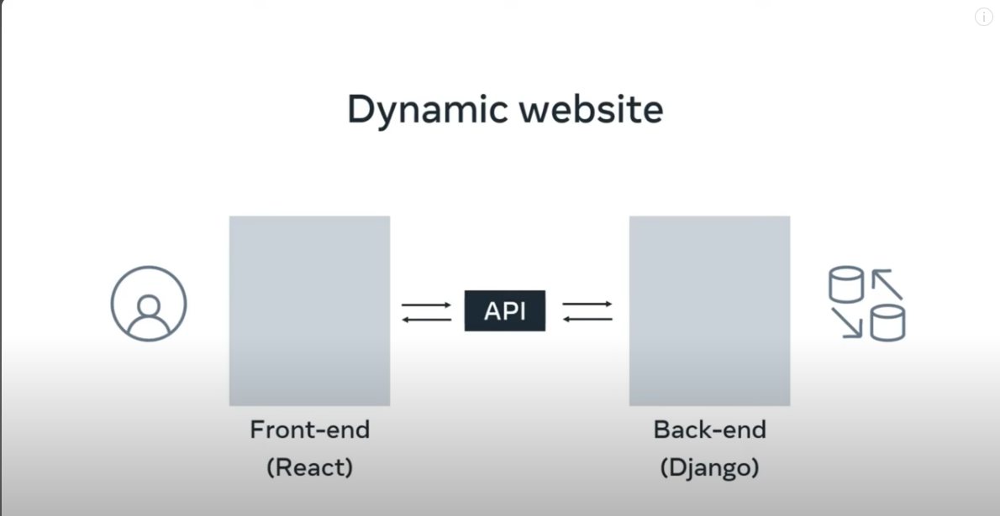.
- Backend Developers can use multiple tools like Email Notifications, Data analysys Tools, Admin Dashboard, Development tools.

### Advantages of Django

- Adaptable and Robust.
- Supportive Community.
- Documentation.
- Security.

## Projects and Overview

Using a Framework Developers can focus mainly on creating functionalities unique to the projects instead of repeating the coding tasks associated with building a web application.
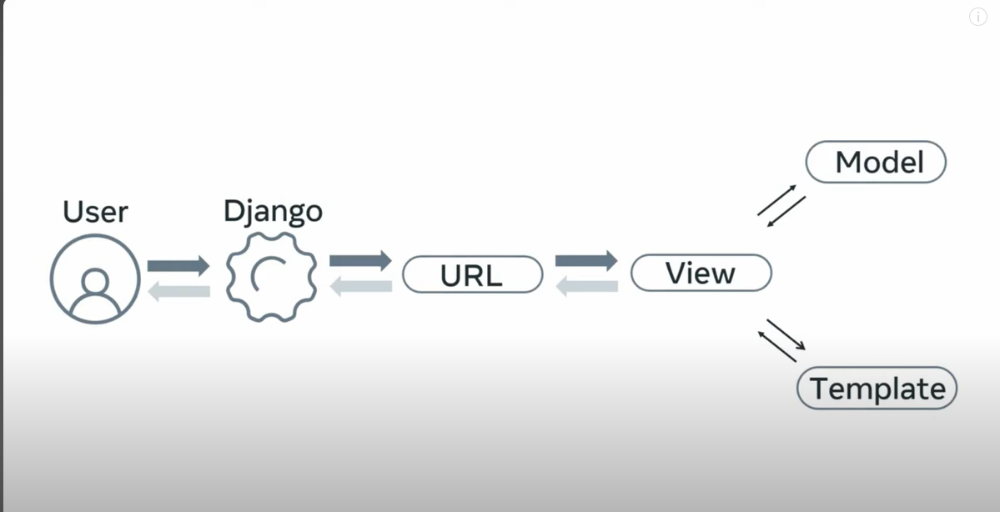

## Internet Protocols

- Every action is tied into a HTTP Request pointing to some URL
- **HTTP Request :-** HTTP is used to get send and render web components.
  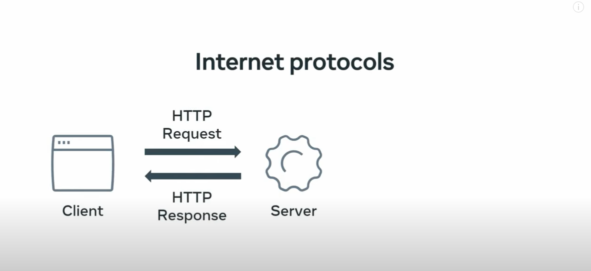
  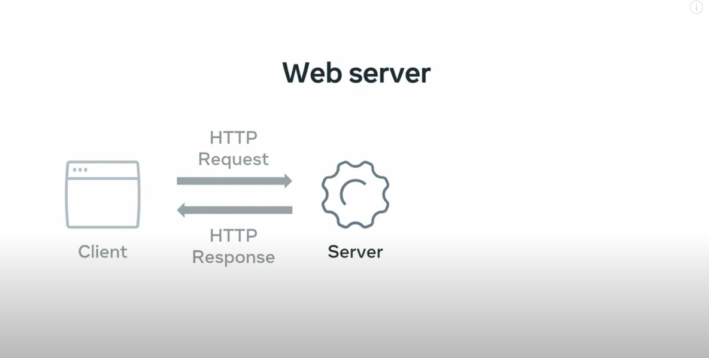
  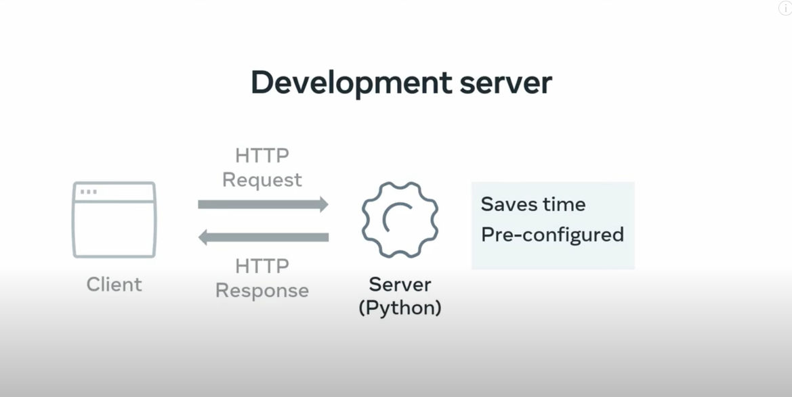
  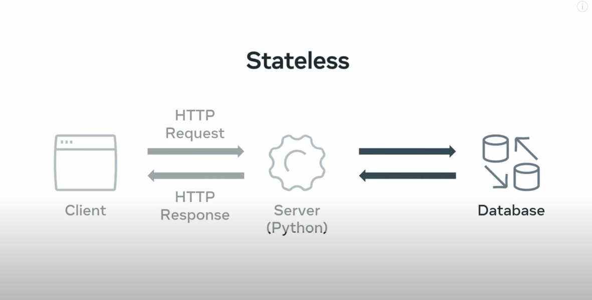

# Django Web application

- **Project:-** In Django a project represents the entire web application.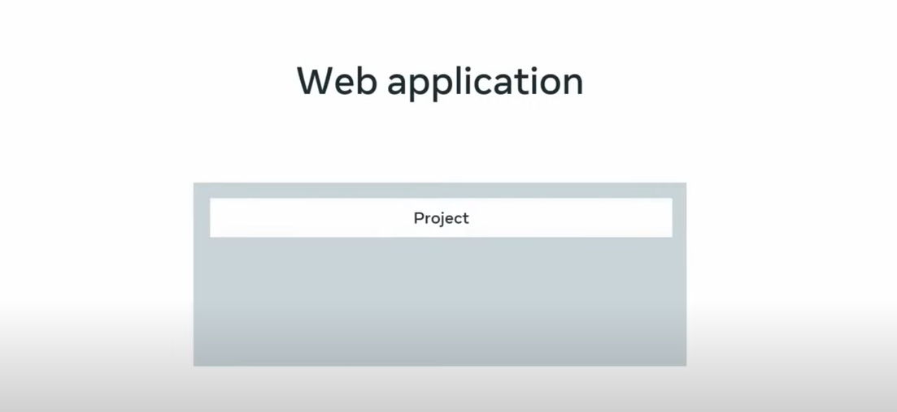
- **App:-** App is the sub module of Project. It is typically used to implement funtionalityfor some specific purposes.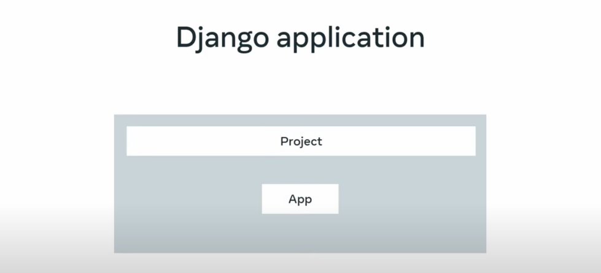 Apps can be self-contained meaning they do not rely on other apps to function as a result tey can be used and reused in may different projects.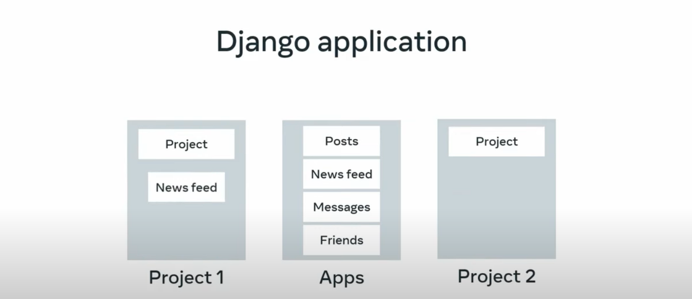

# Structure of Django Project

Django provides a set of commands that auto generates project structure that contains project configuration and settings related to the entire web application.
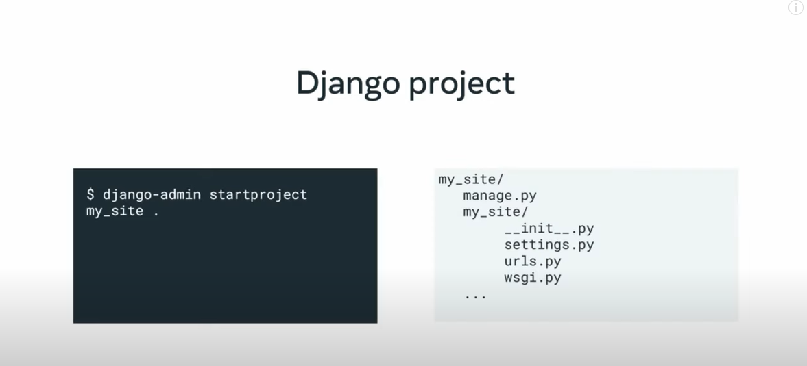

# Creating first Django Project

Django Projects can often be quite large and involve specific dependencies for things like packages. For example you could have a package that has a dependency on a specific version and you donot want this conflicting with your other python and django projects so it's best to keep your projects isolated using a virtual development environmet(venv).

**virtual environment(VENV):-** virtual environments are isolated spaces you create to manage dependencies and the overall project. This allows the interpreter libraries and scripts isolated and installed for a specific project.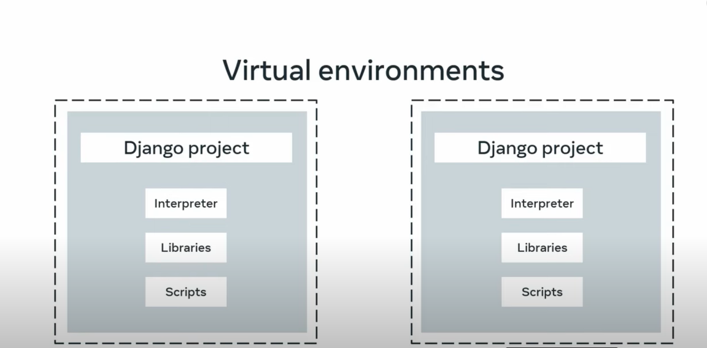
In addition to the functionalities provided Django also comes with an integrated development server this means that the application has a request response relationship with a client.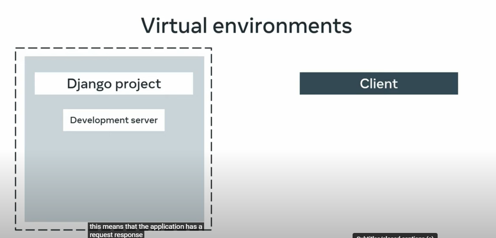

## Creating our first Django Application

- First create a folder for out application.
- Now get into that folder and use `python -m venv first-env` in terminal.
- Now, notice that some new files have been generated in our projects folder.
- Now we have to activate the environment we created. Type `first-env/Scripts/activate` to activate environment.
  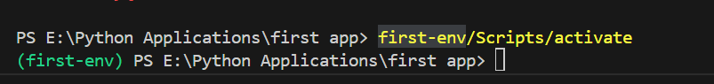
- Now install Django using `pip install django`. To check if django is installed or not use `python -m django version`.
- To create the project we use Django's build-in command `django-admin startproject firstProject`. This will create a new folder with the given name of the project and Django specific supported files.
- Notice there is a file `manage.py` inside our project folder which is the command line utility that works like the Django admin command.
- Now get into out project folder using `cd firstProject` and use `python manage.py runserver` to start the server.
  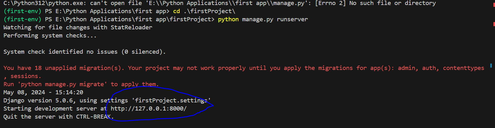
  open the link provided.

## Creating an app inside our firstProject

- As we have discussed before that project represents the entire web-application and `app` is like a sub-module of that project to provide specific functionality.
- Previously, we setup a project folder and created venv inside it. Now we will create an app inside an existing Django project.
- The app will contain a view to output some text to the home page of the web application.
- First create a Django app for the project using app command. `python -m django startapp myapp`
- The start app command has a default syntax where we need to provide the app label and then we have option to specify the destination. In our case the default destination is the current working directory.
- So now we created an app I want to o/p some text to home page and to do this I need to work with Django elements called `routes and views`.When the user visits the application homepage I want to display some text.
- In Django when a user visits a URL it is routed to something called view or controller.

# Views in Django

Python functions that generate the content that makes up web page. They can recieve a request and return a response.

- Now lets create a view in our app. 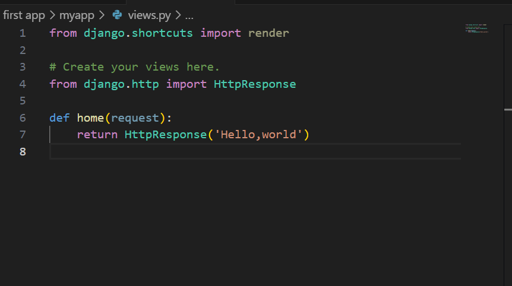
  To make this work we need to map the view function to a `URL` we use in our Django project. URL's we use in the project are stored as `URL Configuration` also known as `URL conf` in the file called `urls.py` which is located in the project Directory.
  **URL Configuration:-** It acts as a maping chart that Django uses to determine which view functions are associated with a specific URL.
- First I import the views file in the URL Config file and next we need to add a file path to the list.

# Three-Tier Architecture

Architecture refers to fundamental structures of Software system.
Modern applications are tend to build using Three-Tier Architecture.
This is a modular based approch to client sever architecture that splits the application into three logical parts.

- Presentation Tier
- Application Tier
- Data Tier
  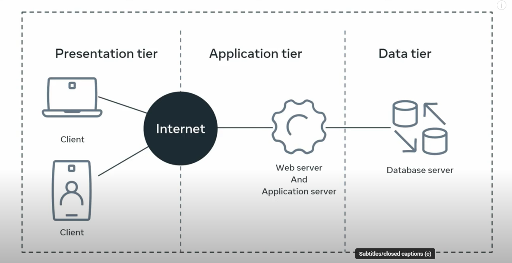

# MVT Architecture

Django organizes a project using Models, Views, Templates commonly known a MVT Arcitecture.

# URL Configuration

- **URL's for app's:-** To design URL's for app we create a python module called URL conf or URL configuration.
  The URL Confs used by View functions are created and updated in the urls.py file. `Django by default creates a urls.py at the project level, additinally it is best practice to create a urls.py file in app level.`This way the respective URL's for an app are clustered but the project also needs to know what urls are used inside each app.

- **For example:** WHen a user make a request for a URL this request is first handled by the urls.py at project level and the Django looks for the variable URL patterns. However the code that contains the logic for URL mapping is at the app level. So we need a way to tell Django to look at the urls.py at the app level.
  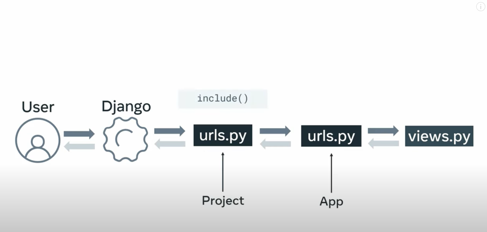

### include()

In the urls.py in project level we create new path inside the URL Patterns list, then inside the path function we pass the reference to the urls.py in the app level as view argument. This allows the project level to access the app level urls. By using `include()` the project level urls.py can inherit the app level urls.py

# HTTP Requests nd Response in Django

- Inside our views.py file import `HttpResponse` using from `django.http import HttpResponse`
- Now we can create our views.

# Mapping URLs with Params

- Previously we used path function and then URL is mapped to a View function. Sometimes devs needs to pass some information to view function for additional processing.
- Django has option to pass values as URL Parameters.
- We can capture a value from a URL using

```
urlpatterns = [
    path('drinks/<str:name>',views.drinks,name = "drinks")
    ]
```

- Here in this we capture params in `<str:name>`
- Now in views.py we can use this captured value by defining name as argument in our view function.

```
def drinks(request,name):
    query = name
    return HttpResponse("<h1>%s</h1>" %query)
```

# RegEx

We can verify the values passed to the view function are correct using RegEx or regular expressions.
In Django devs use RegEx to define, Extract and validate Dynamic URLs paths before they are sent associated view function.
