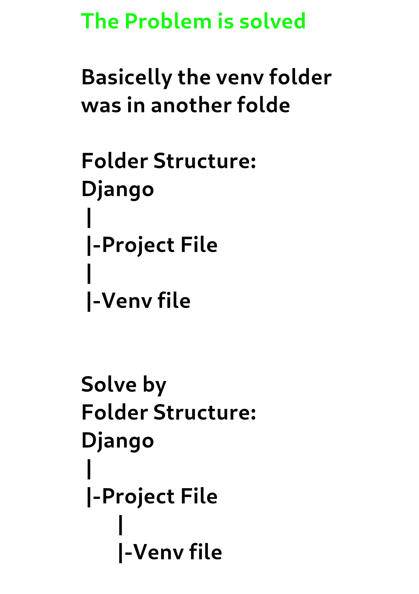

# Setting up Django REST framework

Ideally, you’d want to create a `virtual environment` to isolate dependencies — however, this is optional. Run the command `python -m venv django_env` from inside your projects folder to create the virtual environment. Then, run `./django_env/Scripts/activate` to turn it on if you are no `Windows`.

# Folder Structure

what files need to be ignored for git
whenever we install a package do we need to specify in installed apps explicitly.
